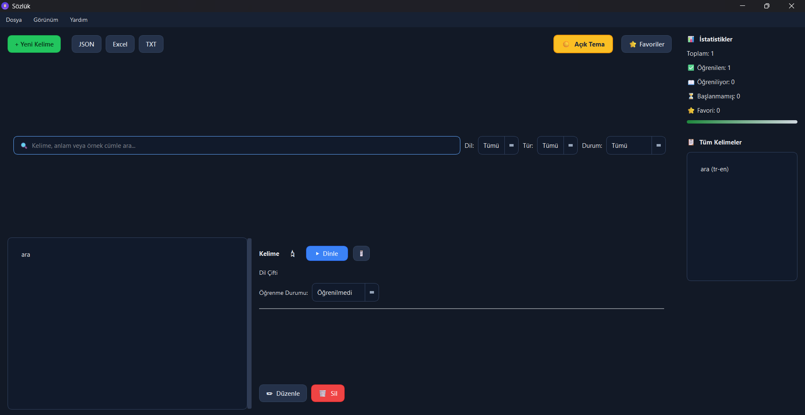
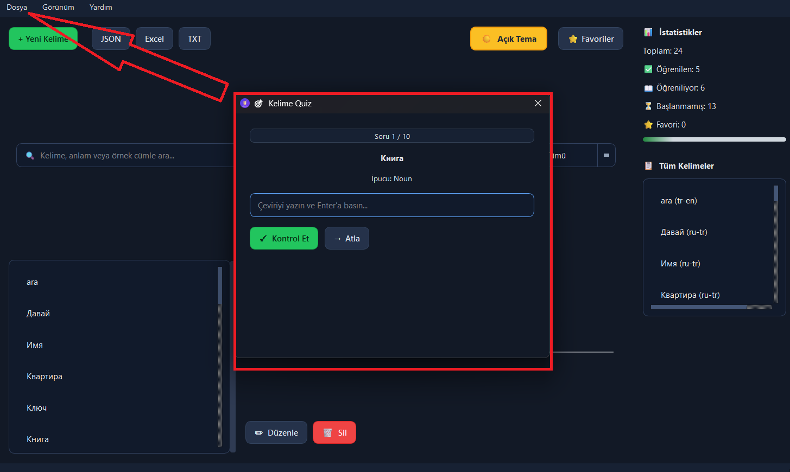
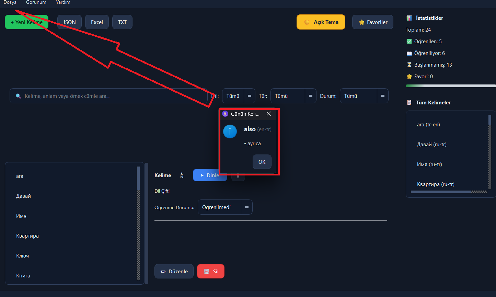
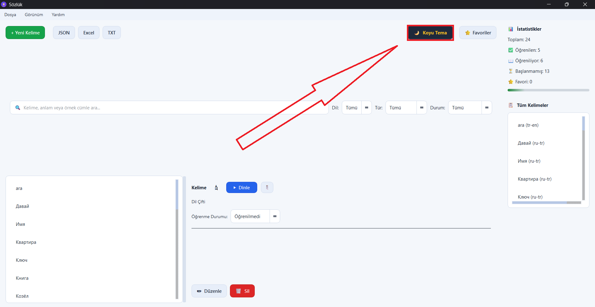
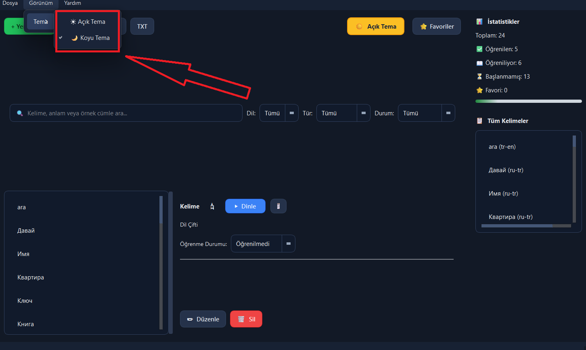
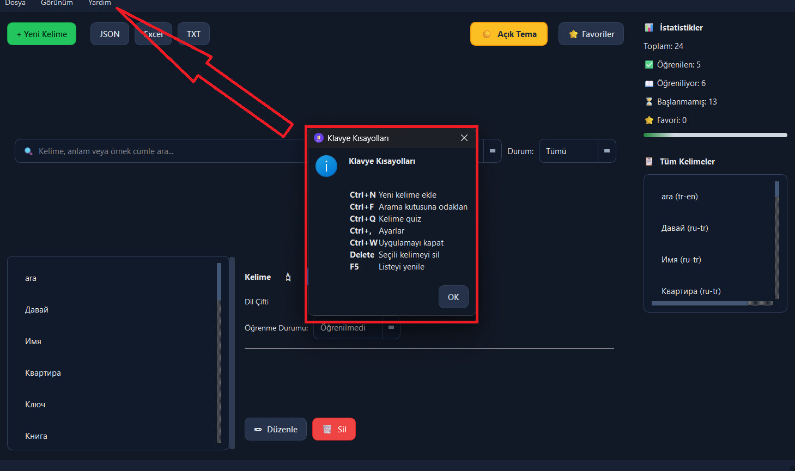
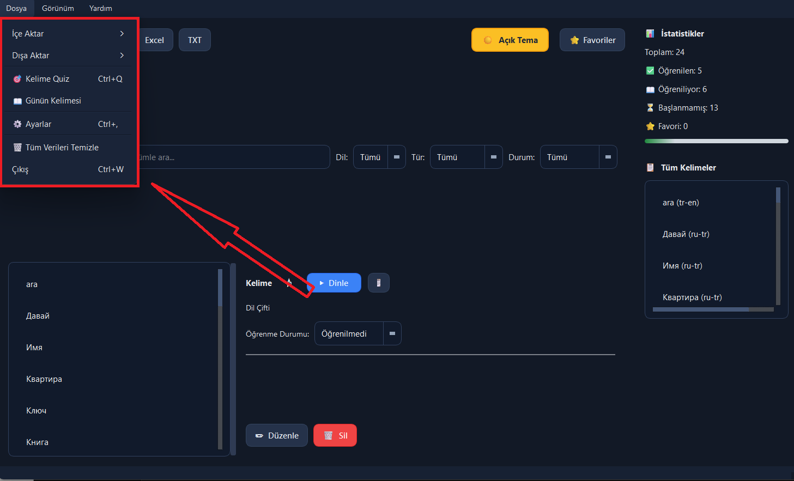
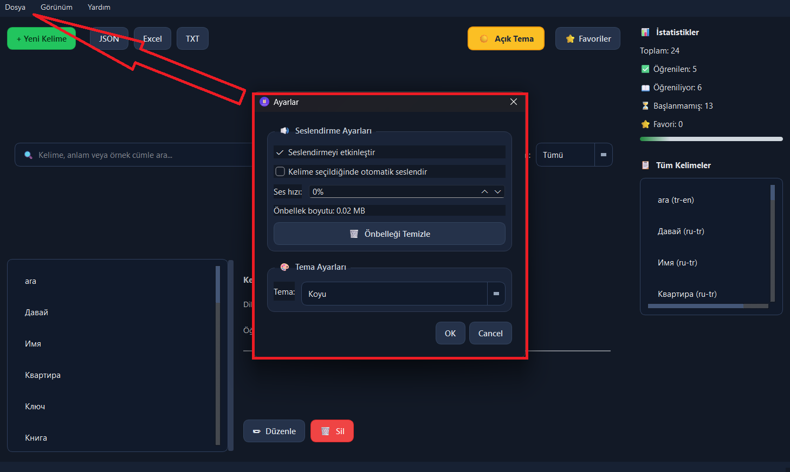
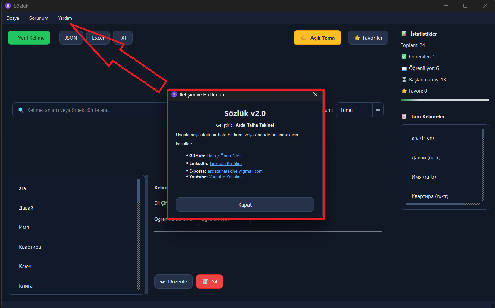

# Sözlük - Offline Desktop Dictionary

Rusça-Türkçe ve İngilizce-Türkçe çevrimdışı sözlük uygulaması.

## Özellikler

- 🔍 Kelime, anlam ve örnek cümle içinde arama
- 🔊 Sesli telaffuz (TTS) — Kelime ve çevirileri dinle
- 💾 Ses önbelleği — Aynı kelime tekrar tekrar internetten çekilmez
- ⭐ Favori kelimeler
- 📊 Öğrenme durumu takibi (Öğrenilmedi / Öğreniliyor / Öğrenildi)
- 🎯 Kelime quiz modu

- 📖 Günün kelimesi

- 🌙 Koyu / Açık tema


- 📋 Panoya kopyalama
- 📂 JSON, Excel, TXT içe/dışa aktarma
- ⌨️ Klavye kısayolları

## Kurulum

```bash
pip install -r requirements.txt
```

## Çalıştırma

```bash
python main.py
```

## Klavye Kısayolları

| Kısayol | İşlem |
|---------|-------|
| Ctrl+N | Yeni kelime ekle |
| Ctrl+F | Arama kutusuna odaklan |
| Ctrl+Q | Kelime quiz |
| Ctrl+, | Ayarlar |
| Ctrl+W | Uygulamayı kapat |
| Delete | Seçili kelimeyi sil |
| F5 | Listeyi yenile |

## TTS (Seslendirme)

İlk kullanımda internet bağlantısı gereklidir. Ses dosyaları `audio_cache/` klasöründe önbelleğe alınır.
İnternet olmadan önceden dinlenmiş kelimeler çalışmaya devam eder.
# Sözlük — Offline Desktop Dictionary 📚

Python ve PyQt6 kullanılarak geliştirilmiş, gelişmiş özelliklere sahip çevrimdışı masaüstü sözlük ve kelime öğrenme uygulaması.

## 🌟 Özellikler
* **Çoklu Dil Desteği:** Rusça-Türkçe, İngilizce-Türkçe ve Türkçe-İngilizce dil çiftleri.
* **Seslendirme (TTS):** Edge-TTS entegrasyonu ve İnternet kullanımını azaltan akıllı ses önbellekleme sistemi.
* **Kelime Quiz:** Öğrenilen kelimeleri pekiştirmek için etkileşimli test modülü.
* **Kelime Durumu Takibi:** "Öğrenilmedi", "Öğreniliyor" ve "Öğrenildi" aşamalarıyla durum analizi.
* **İçe / Dışa Aktarma:** Verileri JSON, Excel ve TXT formatlarında yedekleme veya içe aktarma imkanı.

* **Tema Desteği:** Göz yormayan Açık ve Koyu tema seçenekleri.

## 🚀 Kurulum ve Çalıştırma

1. Repoyu klonlayın:
   ```bash
   git clone [https://github.com/qrda803/sozluk.app.git](https://github.com/arda803/sozluk.app.git)
   cd sozluk.app
## Dil Desteği

| Dil Çifti | Kaynak Dil | Hedef Dil |
|-----------|------------|-----------|
| ru-tr | Rusça | Türkçe |
| tr-ru | Türkçe | Rusça |
| en-tr | İngilizce | Türkçe |
| tr-en | Türkçe | İngilizce |


## İletişim

GitHub: https://github.com/arda803/final-dictionary/issues

LinkedIn: https://www.linkedin.com/in/arda-talha-tekinel-882176351/

Youtube: https://www.youtube.com/@kedilercoksel314


